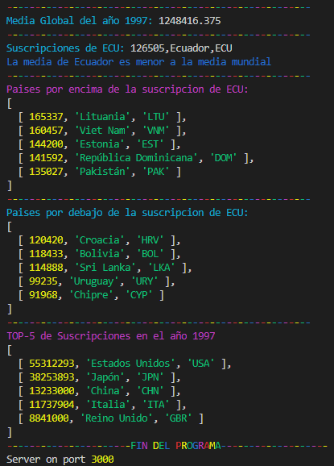
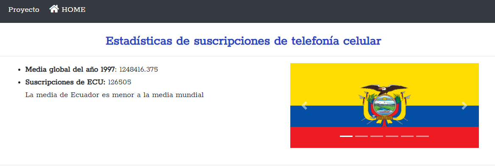
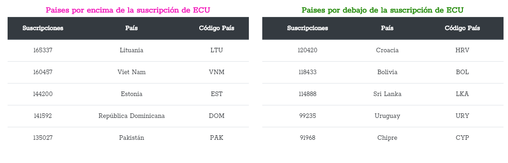
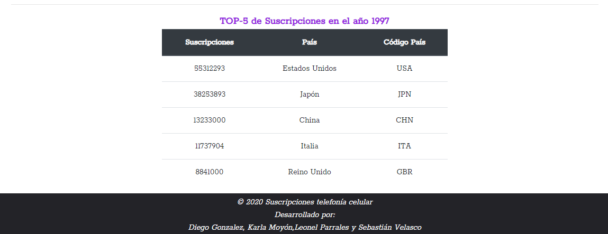
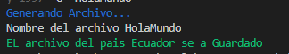
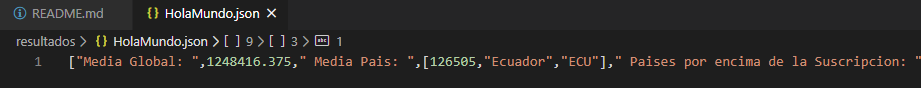

## Plataformas Web P56 - Proyecto Primer Parcial 

Aplicación en NodeJS que permite leer los datos de las
Suscripciones a telefonía celular móvil, publicadas por el Banco
Mundial y publicar las estadísticas de un determinado país en un
año específico.

## Comenzando 🚀

_Estas instrucciones te permitirán obtener una copia del proyecto en funcionamiento en tu máquina local para propósitos de desarrollo y pruebas._

### Pre-requisitos 📋

 * **Git** .- https://git-scm.com<br/><br/>
 * **Node.js** .- https://nodejs.org. Tenga en cuenta que la versión debe ser igual o superior a la versión 8.<br/><br/>
 * **Npm** .- Administrador de paquetes Node.js, viene con Node.js. Asegúrese de que la versión npm sea igual o superior a la versión 5.
<br/>
<!-- 
**Nota.-** Instalar la versión en linux 12.x
   ```
   sudo apt-get install curl
   curl -sLhttps://deb.nodesource.com/setup_12.x | sudo -E bash -
   sudo apt-get install nodejs
   ``` -->
   
 <!-- * **Windows**
 1. Instalar Visual Studio Code
    https://code.visualstudio.com/download
 2. Instalar node.js
    https://nodejs.org/es/
 3. Instalar la extensión del terminal en Visual Studio Code
    En Visual Studio Code, puede abrir una terminal integrada, inicialmente comenzando en la raíz de su espacio de trabajo. -->


### Instalación 🔧

_Cuando haya completado la configuración de herramientas, debe descargar el código de la aplicación. La forma más fácil de hacerlo es clonar el repositorio de GitHub:_

```
git clone https://github.com/karlaVane/Proyecto-VII-Node.JS.git
```

_Una vez completado la clonación, se debe instalar los módulos npm_

```
cd Proyecto-VII-Node.JS && npm install --save
```

## Ejecutando las pruebas ⚙️

Descargar la data de la siguiente dirección web: [Suscripciones a telefonía celular móvil](http://api.worldbank.org/v2/es/indicator/IT.CEL.SETS?downloadformat=csv)


Para ejecutar y visualizar los resultados en consola y página web, se deberá ingresar los parámetros según el comando:
```
node app publicar -f="NombreDirectorio" -c="CódigoPaís" -y="Año desde 1960 hasta 2018"
```
```
node app guardar -f="NombreDirectorio" -c="CódigoPaís" -y="Año desde 1960 hasta 2018" -o="NombreNuevoArchivo"
```

1. **Nombre de directorio.-** Se deberá ingresar la ruta donde se encuentra ubicado el archivo de la data descargada.

```
"/home/Downloads/API_IT.CEL.SETS_DS2_es_csv_v2_1004854.csv" 
```

2. **Codigo del Pais.-** País a analizar a través de su código [ISO 3166 ALPHA-3](https://laendercode.net/es/3-letter-list.html).

```
"ECU" 
```
3. **Año.-** Desde 1960 hasta 2018
```
1997 
```

4. **Nombre del nuevo archivo.-** Establece el nombre del archivo donde se almacenará
los resultados en formato JSON.
```
Resultados
```

**Ejemplos:**
```
node app.js publicar -f="/home/Downloads/API_IT.CEL.SETS_DS2_es_csv_v2_1004854.csv"  -c="ECU" -y=1997
```
```
node app.js guardar -f="/home/Downloads/API_IT.CEL.SETS_DS2_es_csv_v2_1004854.csv" -c="ECU" -y=1997 -o="Resultados"
```

**NOTA:** En caso de no abrir automáticamente el servidor local, acceder a: http://localhost:3000/
<br>

### **Ejecución:**
* **Comando publicar:**
**Ejecución en consola:**
<center><br></center>

**Ejecución en navegador:**
<center><br>
<br>
<br></center>

* **Comando guardar:**
**Ejecución en consola:**
<center><br></center>

**Archivo json guardado:**
<center><br></center>


### Comandos:
* **publicar:** tiene por parametros obligatorios a:
   * _file  -f_ : En este comando se ingresa el directorio o path donde esta ubicado los datos de las suscripciones moviles por pais.
   * _country_ -> alias -c: En este comando se ingresa el codigo de del pais.
   * _year_ -> alias -y: Permite especificar el año para el cual se requiere las estadísticas.

* **guardar:** que tiene por parametros obligatorios a:
   * _file_ -> alias -f: En este comando se ingresa el directorio o path donde esta ubicado los datos de las suscripciones moviles por pais.
   * _country_ -> alias -c: En este comando se ingresa el codigo de del pais .
   * _year_ -> alias -y: En este comando permite especificar el año para el cual se requiere las estadísticas.
   out -> alais -o: Establece el nombre del archivo donde se almacenará los resultados.

## Construido con 🛠️

_Las herramientas utilizadas en el proyecto:_

* [Visual Studio code](https://code.visualstudio.com/) - Editor de código fuente
**Librerías** 
* [colors](https://www.npmjs.com/package/colors) - colores a la ejecucion de la terminal
* [express](https://expressjs.com/es/) - Express es una infraestructura de aplicaciones web Node.js
* [ejs](https://ejs.co/) - Motor de plantillas
* [morgan](https://www.npmjs.com/package/morgan) - Middleware de registrador de solicitudes HTTP para node.js
* [opn](https://www.npmjs.com/package/open) - Abre automáticamente el navegador al momento de ejecutar el comando publicar
* [yargs](https://www.npmjs.com/package/yargs) - Yargs te ayuda a crear herramientas interactivas de línea de comandos, analizando argumentos y generando una elegante interfaz de usuario.
* [neat-csv](https://www.npmjs.com/package/neat-csv) - Analizador CSV rápido

## Versionado 📌

Para todas las versiones disponibles, mira los [tags en este repositorio](https://github.com/karlaVane/Proyecto-VII-Node.JS/tags).

## Autores ✒️

* **Gonzalez Diego** - [dgonzalezq2](https://github.com/dgonzalezq2)
* **Moyón Karla** - [karlaVanel](https://github.com/karlaVane/)
* **Parrales Leonel** - [leonelparrales22](https://github.com/leonelparrales22)
* **Velasco Sebastián** - [seguvega](https://github.com/seguvega)

También puedes mirar la lista de todos los [contribuyentes](https://github.com/karlaVane/Proyecto-VII-Node.JS/graphs/contributors) quíenes han participado en este proyecto. 

## Licencia 📄

Este proyecto está bajo la Licencia (MIT License) - mira el archivo [LICENSE.md](LICENSE.md) para detalles

⌨️ con ❤️ por [González Diego, Moyón Karla, Parrales Leonel, Velasco Sebastián](https://github.com/karlaVane/Proyecto-VII-Node.JS) 😊
